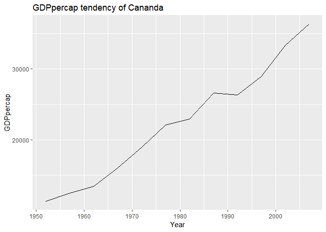

###Bring data package gapminder and tidyverse meta-package in

```r
library(gapminder)
```

```
## Warning: package 'gapminder' was built under R version 3.4.4
```

```r
library(tidyverse)
```

```
## Warning: package 'tidyverse' was built under R version 3.4.4
```

```
## -- Attaching packages ------------------------------------------------------------------------------ tidyverse 1.2.1 --
```

```
## √ ggplot2 3.0.0     √ purrr   0.2.5
## √ tibble  1.4.1     √ dplyr   0.7.6
## √ tidyr   0.8.1     √ stringr 1.2.0
## √ readr   1.1.1     √ forcats 0.3.0
```

```
## Warning: package 'ggplot2' was built under R version 3.4.4
```

```
## Warning: package 'tidyr' was built under R version 3.4.4
```

```
## Warning: package 'readr' was built under R version 3.4.4
```

```
## Warning: package 'purrr' was built under R version 3.4.4
```

```
## Warning: package 'dplyr' was built under R version 3.4.4
```

```
## Warning: package 'forcats' was built under R version 3.4.4
```

```
## -- Conflicts --------------------------------------------------------------------------------- tidyverse_conflicts() --
## x dplyr::filter() masks stats::filter()
## x dplyr::lag()    masks stats::lag()
```

```r
library(ggplot2)
```


###Smell test the data


```r
typeof(gapminder)
```

```
## [1] "list"
```

```r
head(gapminder)
```

```
## # A tibble: 6 x 6
##   country     continent  year lifeExp      pop gdpPercap
##   <fctr>      <fctr>    <int>   <dbl>    <int>     <dbl>
## 1 Afghanistan Asia       1952    28.8  8425333       779
## 2 Afghanistan Asia       1957    30.3  9240934       821
## 3 Afghanistan Asia       1962    32.0 10267083       853
## 4 Afghanistan Asia       1967    34.0 11537966       836
## 5 Afghanistan Asia       1972    36.1 13079460       740
## 6 Afghanistan Asia       1977    38.4 14880372       786
```

```r
str(gapminder)
```

```
## Classes 'tbl_df', 'tbl' and 'data.frame':	1704 obs. of  6 variables:
##  $ country  : Factor w/ 142 levels "Afghanistan",..: 1 1 1 1 1 1 1 1 1 1 ...
##  $ continent: Factor w/ 5 levels "Africa","Americas",..: 3 3 3 3 3 3 3 3 3 3 ...
##  $ year     : int  1952 1957 1962 1967 1972 1977 1982 1987 1992 1997 ...
##  $ lifeExp  : num  28.8 30.3 32 34 36.1 ...
##  $ pop      : int  8425333 9240934 10267083 11537966 13079460 14880372 12881816 13867957 16317921 22227415 ...
##  $ gdpPercap: num  779 821 853 836 740 ...
```

```r
summary(gapminder)
```

```
##         country        continent        year         lifeExp     
##  Afghanistan:  12   Africa  :624   Min.   :1952   Min.   :23.60  
##  Albania    :  12   Americas:300   1st Qu.:1966   1st Qu.:48.20  
##  Algeria    :  12   Asia    :396   Median :1980   Median :60.71  
##  Angola     :  12   Europe  :360   Mean   :1980   Mean   :59.47  
##  Argentina  :  12   Oceania : 24   3rd Qu.:1993   3rd Qu.:70.85  
##  Australia  :  12                  Max.   :2007   Max.   :82.60  
##  (Other)    :1632                                                
##       pop              gdpPercap       
##  Min.   :6.001e+04   Min.   :   241.2  
##  1st Qu.:2.794e+06   1st Qu.:  1202.1  
##  Median :7.024e+06   Median :  3531.8  
##  Mean   :2.960e+07   Mean   :  7215.3  
##  3rd Qu.:1.959e+07   3rd Qu.:  9325.5  
##  Max.   :1.319e+09   Max.   :113523.1  
## 
```

```r
ncol(gapminder)
```

```
## [1] 6
```

```r
nrow(gapminder)
```

```
## [1] 1704
```

```r
length(gapminder)
```

```
## [1] 6
```

```r
length(gapminder$country)
```

```
## [1] 1704
```

```r
ls(gapminder)
```

```
## [1] "continent" "country"   "gdpPercap" "lifeExp"   "pop"       "year"
```

```r
typeof(gapminder$country)
```

```
## [1] "integer"
```

```r
typeof(gapminder$continent)
```

```
## [1] "integer"
```

```r
typeof(gapminder$year)
```

```
## [1] "integer"
```

```r
typeof(gapminder$lifeExp)
```

```
## [1] "double"
```

```r
typeof(gapminder$pop)
```

```
## [1] "integer"
```

```r
typeof(gapminder$gdpPercap)
```

```
## [1] "double"
```


###Individual variables

```r
ye<- gapminder$year
range(ye)
```

```
## [1] 1952 2007
```

```r
length(ye)
```

```
## [1] 1704
```

```r
summary(ye)
```

```
##    Min. 1st Qu.  Median    Mean 3rd Qu.    Max. 
##    1952    1966    1980    1980    1993    2007
```

```r
arrange(gapminder,year)
```

```
## Warning: package 'bindrcpp' was built under R version 3.4.4
```

```
## # A tibble: 1,704 x 6
##    country     continent  year lifeExp      pop gdpPercap
##    <fctr>      <fctr>    <int>   <dbl>    <int>     <dbl>
##  1 Afghanistan Asia       1952    28.8  8425333       779
##  2 Albania     Europe     1952    55.2  1282697      1601
##  3 Algeria     Africa     1952    43.1  9279525      2449
##  4 Angola      Africa     1952    30.0  4232095      3521
##  5 Argentina   Americas   1952    62.5 17876956      5911
##  6 Australia   Oceania    1952    69.1  8691212     10040
##  7 Austria     Europe     1952    66.8  6927772      6137
##  8 Bahrain     Asia       1952    50.9   120447      9867
##  9 Bangladesh  Asia       1952    37.5 46886859       684
## 10 Belgium     Europe     1952    68.0  8730405      8343
## # ... with 1,694 more rows
```

```r
life<- gapminder$lifeExp
range(life)
```

```
## [1] 23.599 82.603
```

```r
length(life)
```

```
## [1] 1704
```

```r
summary(life)
```

```
##    Min. 1st Qu.  Median    Mean 3rd Qu.    Max. 
##   23.60   48.20   60.71   59.47   70.85   82.60
```

```r
po<- gapminder$pop
range(po)
```

```
## [1]      60011 1318683096
```

```r
length(po)
```

```
## [1] 1704
```

```r
summary(po)
```

```
##      Min.   1st Qu.    Median      Mean   3rd Qu.      Max. 
## 6.001e+04 2.794e+06 7.024e+06 2.960e+07 1.959e+07 1.319e+09
```

```r
gdp<-gapminder$gdpPercap
range(gdp)
```

```
## [1]    241.1659 113523.1329
```

```r
length(gdp)
```

```
## [1] 1704
```

```r
summary(gdp)
```

```
##     Min.  1st Qu.   Median     Mean  3rd Qu.     Max. 
##    241.2   1202.1   3531.8   7215.3   9325.5 113523.1
```

```r
hist(gapminder$lifeExp, breaks = 12, col="grey", xlab = "LifeExpectency", main="Life expectency distribution")
```

<!-- -->

```r
hist(gapminder$gdpPercap, breaks = 12, col = "light blue", xlab = "GDP per Cap", main = "GDPpercap distribution")
```

<!-- -->


###Explore various plot types


```r
plot(gapminder$gdpPercap, gapminder$lifeExp, xlab ="GDPperCap", ylab = "Life Expectency", main="Scatter plot of GDPper and LifeExp")
```

<!-- -->

```r
can<- filter(gapminder, country=="Canada")
plot(can$year,can$lifeExp, xlab = "Year", ylab = "Life expectancy", main = "Life expectancy tendency of Canada")
```

<!-- -->

```r
plot(can$year,can$gdpPercap, xlab = "Year", ylab = "GDPperCap", main = "GDPpercap tendency of Canada")
```

<!-- -->

```r
asia<- filter(gapminder, continent=="Asia")

hist(asia$lifeExp,breaks = 12, col="grey", xlab = "LifeExpectency ", main="Life expectency distribution of Asia")
```

<!-- -->

```r
afri<- filter(gapminder,continent=="Africa")
ls(afri)
```

```
## [1] "continent" "country"   "gdpPercap" "lifeExp"   "pop"       "year"
```

```r
hist(afri$lifeExp,breaks = 12, col="grey", xlab = "LifeExpectency ", main="Life expectency distribution of Africa")
```

<!-- -->

###Use filter(), select() and %>%

```r
gapminder %>% 
  select(pop,gdpPercap) %>% 
  filter(pop>2.960e+07 & gdpPercap>1000) %>% 
  plot(xlab="Population",ylab = "GDPpercap")
```

<!-- -->

```r
qplot(gapminder$lifeExp, gapminder$gdpPercap, xlab = "Life expectancy", ylab = "GDPpercap")
```

<!-- -->
